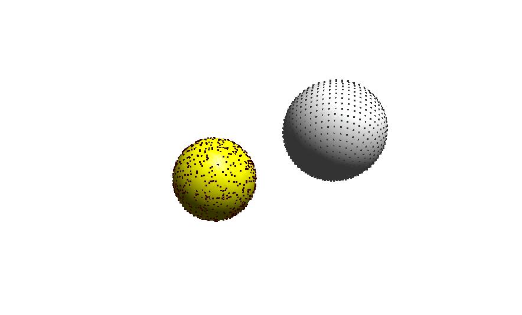

# OpenGL Sphere point sampling

Implementation of point sampling on a sphere using OpenGL (freeglut) on multiple threads. It generates samples using two different methods:

1. Uniform sampling
2. Regular sampling

based on [this](https://www.cmu.edu/biolphys/deserno/pdf/sphere_equi.pdf) link.

## screenshot
- Yellow sphere: uniform sampling
- White sphere: regular sampling
